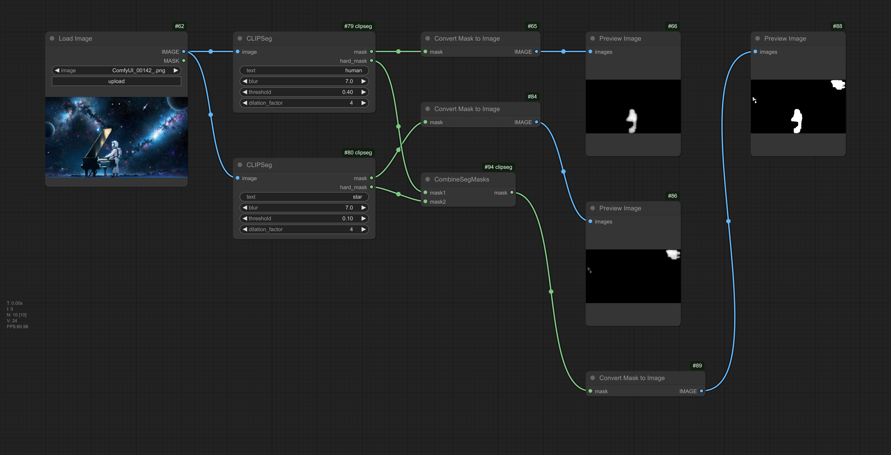

[中文版](README_zh.md)
[English](README.md)

# ComfyUI自定义节点: CLIPSeg和CombineSegMasks

## 利用[CLIPSeg模型](https://huggingface.co/docs/transformers/main/en/model_doc/clipseg)基于文本提示生成用于图像修复任务的蒙版。

### 1. CLIPSeg
CLIPSeg节点根据给定的输入图像和文本提示生成二值蒙版。

**输入:**

- image: 表示输入图像的torch.Tensor。
- text: 表示文本提示的字符串。
- blur: 控制应用于蒙版的高斯模糊量的浮点值(0-15,默认值:7)。
- threshold: 控制创建二值蒙版阈值的浮点值(0-1,默认值:0.4)。
- dilation_factor: 控制二值蒙版膨胀的整数值(0-10,默认值:4)。

**输出:**

- mask: 表示带平滑边缘的软蒙版的torch.Tensor。
- hard_mask: 表示带硬边缘的二值蒙版的torch.Tensor。

### 2. CombineSegMasks
CombineSegMasks节点将两个蒙版合并为一个蒙版。

**输入:**

- mask1: 表示第一个蒙版的torch.Tensor。
- mask2: 表示第二个蒙版的torch.Tensor。

**输出:**

- mask: 表示合并后蒙版的torch.Tensor。

## 安装
要在ComfyUI项目中使用这些自定义节点,请按以下步骤操作:

1. 将此仓库克隆到ComfyUI/custom_nodes/
2. 即可使用

## 使用方法
以下是预期工作流程的示例。
示例的[json文件](workflow/workflow_clipseg.json)可以在'workflow'目录中找到。

## 参考

感谢 https://github.com/biegert/ComfyUI-CLIPSeg